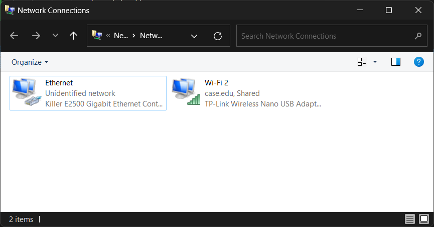
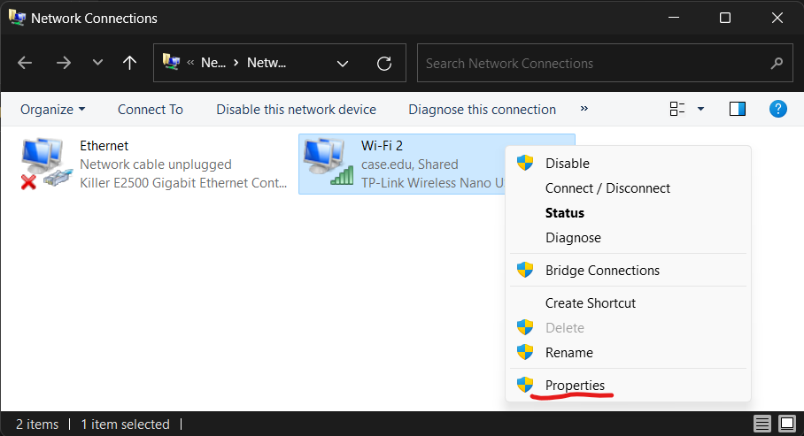
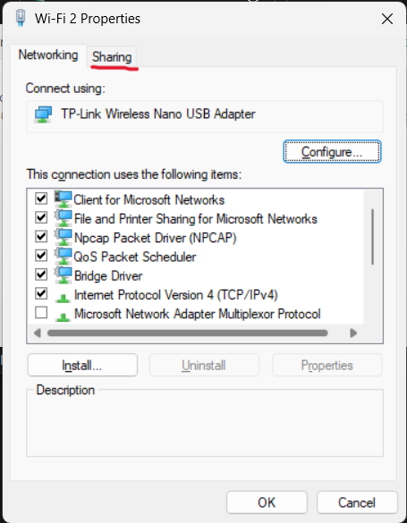
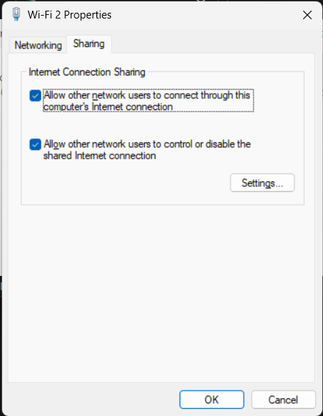
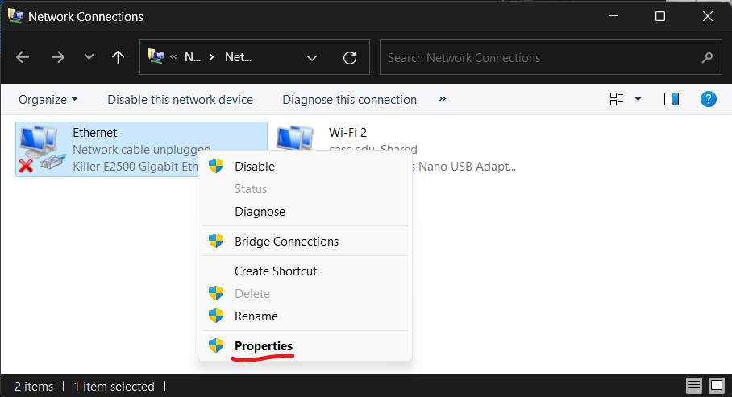
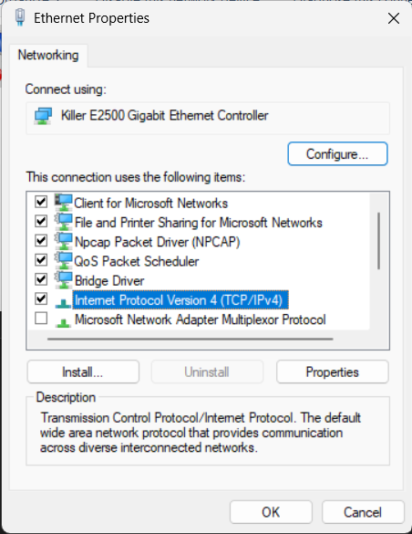
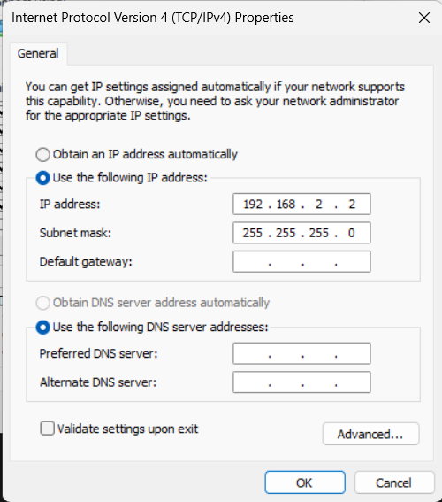

# Pi Main

## Overview

This package launches the rest of the Pi packages. It should be run on Pi boot up.

## Setup

### Flashing

If something ever happens to the Pi follow [this](https://www.jeffgeerling.com/blog/2020/how-flash-raspberry-pi-os-compute-module-4-emmc-usbboot) tutorial on reflashing it.

### Setup ad-hoc network between two Ubuntu devices

Do this to get two Ubuntu devices to network over a single ethernet cable.

Run the following commands on both devices:

```bash
sudo nmcli connection add type ethernet ifname eth0
sudo nmcli connection modify ethernet-eth0 ipv4.method link-local
nmcli connection up ethernet-eth0
```

### Setup Pi SSH access over Ethernet

1. Using a monitor keyboard, connect to the Pi and edit `/etc/netplan/50-cloud-init.yaml`. Either use a flash drive to replace that file with the version below or type it out by hand (sorry):

    ```yaml
    network:
        ethernets:
            eth0:
                dhcp4: no
                addresses: [192.168.2.1/24]
                optional: true
                nameservers:
                    addresses: [8.8.8.8]
                routes:
                - to: default
                    via: 192.168.2.2
        version: 2
    ```

2. On the Pi, run `sudo netplan try`, then press enter to accept the changes.

3. Connect the Pi to your PC with an ethernet cable

#### Linux

1. Open Advanced Network Configuration applet

2. Select the network under Ethernet

3. Under IPv4 Settings set the Method `Shared to other computers`

4. Set the Address to 192.168.2.2 and the Netmask to 24

#### Windows

1. On Windows, search "view network connections" in the search bar, this should bring you to the control panel.

    

2. Right click on your wifi adapter and click on "Properties".

    

3. Go to the "sharing" tab.

    

4. Check both checkboxes, and accept any popups. If there is a dropdown menu, select your ethernet adapter. Press "OK".

    

5. Now right click on your ethernet adapter and choose "Properties".

    

6. Double click on "Internet Protocol Version 4".

    

7. Set the IP address to "192.168.2.2". Set the subnet mask to "255.255.255.0".

    

## Testing

1. In the terminal, run `ssh rov@192.168.2.1` The password should be `rov12345`.

2. You are now connected to the Pi! You should be able to `ping google.com` and see a reply, indicating that the Pi has access to the internet.

## Installation

You need to run these commands to get the launch file running on Pi boot:

```bash
ros2 run pi_main install 
```

```bash
sudo systemctl daemon-reload && sudo systemctl start cwrubotix_pi
```

These commands should be run in the `src` folder after a colcon build in the workspace folder.

WARNING: Python packages must be installed with sudo for startup code to see them.

### Adding udev Rules

This should automatically be done by the prior command `ros2 run pi_main install`. If not, copy all the .rules files from `udev_rules` in this package to the `/etc/udev/rules.d` directory to use USB devices properly.

## Usage

[Tutorial followed](https://roboticsbackend.com/make-ros-launch-start-on-boot-with-robot_upstart/)

### Testing without Rebooting

Installing & setting up this package creates a startup task called `cwrubotix_pi`. You can manually start and stop this task.

You should run the `cwrubotix_pi` task in the foreground for testing (**make sure to kill the background task first - see below**):

```bash
sudo cwrubotix_pi-start
```

To run the `cwrubotix_pi` task in the background (happens on Pi startup):

```bash
sudo systemctl start cwrubotix_pi.service
```

To kill the `cwrubotix_pi` background task (**do this before starting the foreground task**):

```bash
sudo systemctl stop cwrubotix_pi.service
```

To completely uninstall the `cwrubotix_pi` task:

```bash
ros2 run robot_upstart uninstall cwrubotix_pi
```

## Nodes

There are no nodes in this package.

## Launch files

* **pi_launch.py**: launch the manipulators, camera streaming, and pixhawk packages

